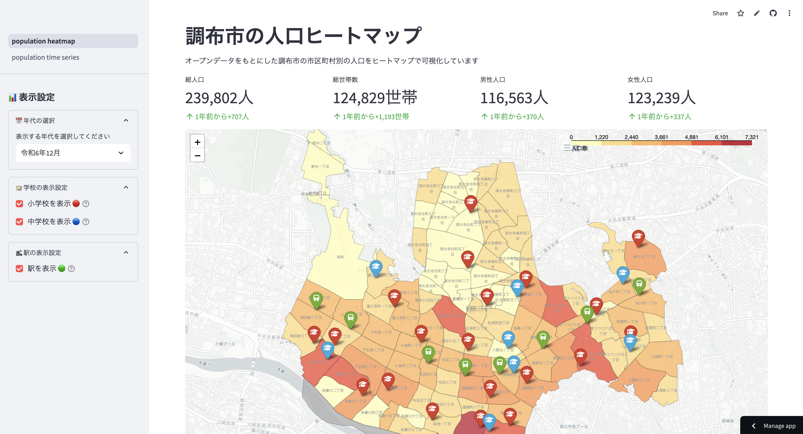
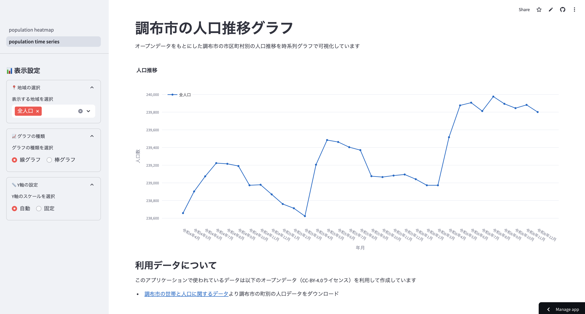

# streamlit-chofu-visualization

調布市のオープンデータをもとにしたStreamlitの可視化アプリケーション

https://chofu-population.streamlit.app/ にdeployしています

### 人口密度のヒートマップ可視化

選択した年月の市区町村ごとの人口密度を可視化しています。



### 人口遷移の可視化

市区町村ごとの人口数の推移を可視化しています。



```
$ streamlit run main.py
```

# 利用データについて
このアプリケーションで使われているデータは以下のオープンデータ（CC-BY-4.0ライセンス）を利用して作成しています

* [調布市の世帯と人口に関するデータ](https://www.city.chofu.lg.jp/030040/p017111.html)より調布市の町別の人口データをダウンロード
* [市立小・中学校に関するデータ](https://www.city.chofu.lg.jp/100010/p054122.html)より市立小・中学校一覧をダウンロード
* [国勢調査町丁・字等別境界データセット](https://geoshape.ex.nii.ac.jp/ka/resource/)より調布市のTopoJSONファイルをダウンロード
